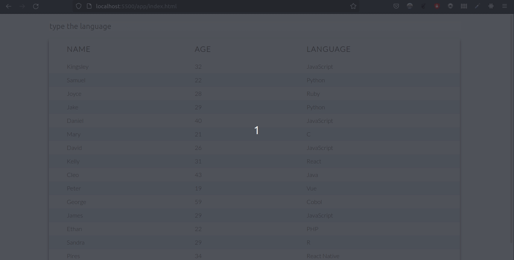

# Responsive filterable table with HTML, CSS and JavaScript

## Descrition

This is a responsive filterable table which displays a list of developers, their age, and the language they work with. You can filter developers by specifying a language on the filter input.

The difference between this and the original project is that I've decided use JavaScript to generate the rows of the table. I did it because when filtering the results the CSS used to alternate row colors became problematic, since the index of the row does not change when it is not being displayed, which results in consecutive rows having the same color in some cases.

## Demo

## Credits

The original project can be found at [How to Build a Responsive Form with Filter Functionality Using HTML, CSS, and JavaScript](https://www.freecodecamp.org/news/build-a-responsive-filterable-form-with-css-and-javascript/)
